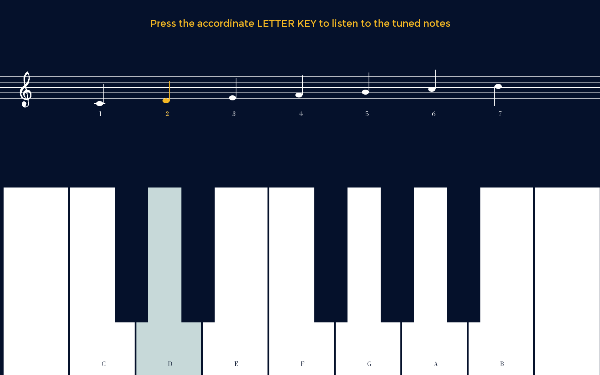

# Game - Absolute Tone

## Game Demo Video

## Idea/ Concept 

As someone who has played the piano for more than 20 years, it is frustrated for me to not be able to identify what a musical note is by just hearring it. That's the start of this project. It is for someone like me and open to everyone who want to train their ear, no matter he/she has a music background or not. 

This is a game about training your ears to have perfect pitch. This game includes an educational page for players who are not familar with how to read music notes and scores. The notes are played by different intruments and include not-tuned notes to confuse your ears.

## Funtionality

### FIRST PAGE

1. Instruction and the concept of this game are written in two floating circles.
2. When the two circles hit each other, it will be the second page-an educational page. 
3. If you want to skip to the game directly, click anywhere on the screen.

### SECOND PAGE - EDUCATIONAL PAGE

1. Get familiar with the keyboard and notes. 
2. Press LETTER KEYS to listen to the tuned notes. As you press the letter, the associated note and its location on the piano keyboard will be highlighted.
3. When you are ready, click anywhere on the screen to play.

### THIRD PAGE - GAME

1. Everytime you click the mouse, there will be a note played (played randomly). The notes are played by different intruments (classic guitar and cello). There are not tuned notes added to confuse your ear.
2. Press NUMBER KEYS to the music notes. 
3. Press RIGHT ARROW if you think the notes is not tuned.
4. The score is shown on the up left corner. The hint of right or wrong will indicated by two pages flashing. The hint of right answer will flash on the up right corner if you press the wrong key(improved from the above sampe page of WRONG answer).

## Test - Played by a Friend

## Credit List

1. Music Notes (Guitar) - Played and Recorded by me
2. Music Notes (Cello) - Played and Recorded by a dear friend, Zeta Gao

