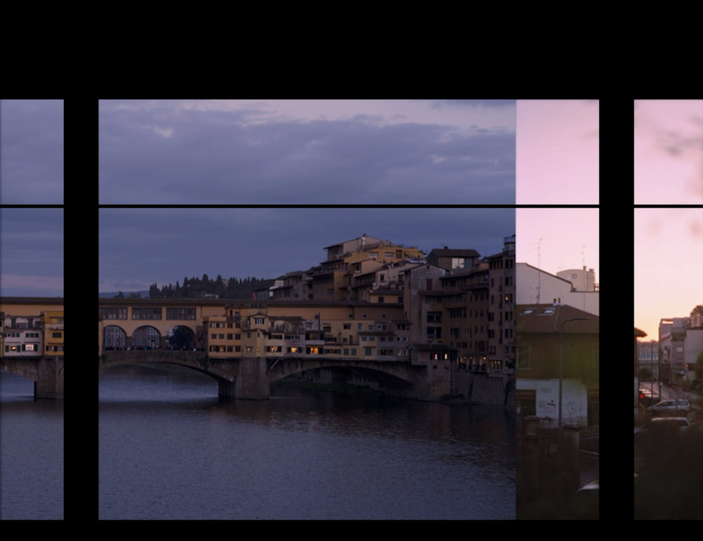

# Project 1 Narrative - L'ultima Canzone

## Narrative

This is a story based on my personal experience of traveling and living in different countries. The narrative starts with and mainly reflects on my experience of living with my host family in Milan, Italy. It is a story of saying goodbye, but with a warm ending.

## Scene Breakdown

### Scene 1 - Memory Flash Back

### Scene 2 - City Disappearring

Painting of City of Milan in the background, painted by me. 

### Scene 3 - First Scene of the New Place / The Empty Room

### Scene 4 - Heartbroken

### Scene 5 - Night, Being Alone

### Scene 6 - From Night to Day

### Scene 7 - Crying Face 

### Scene 8 - Starting the Journey Again

Selection of Archival Photos from Traveling  

### Scene 9 - Stamp Collected from Different Trips

### Scene 10 - Snowy Day - Dream Back 

Fantaisie Impromptu in the background. This is the piece I played for my host family before I left. 

### Scene 11 - Flash Back in the Dream

## Music List

Recorded and Played by me.

1. Españoletas, Guitar
2. Moonlight Sonata (Beethoven), Piano
3. Fantaisie Impromptu (Chopin), Piano 
4. Air on the G String (Bach), Piano

